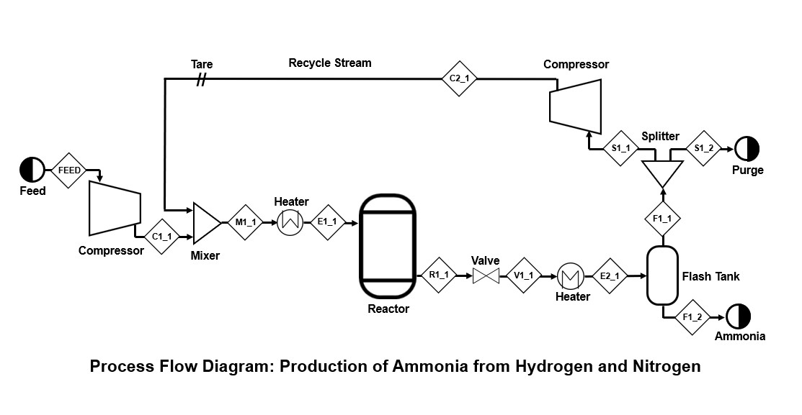

# Ammonia-sequential-modular-simulation

Sequential-modular Python implementation of the production of ammonia from hydrogen and nitrogen.
Below is a process flow diagram (PFD) of the modeled process. 

All chemical process units (e.g. compressor, reactor, heater, etc.) were modeled as individual functions. 
The class "Stream" was used to create stream objects which were passed into and returned from the chemical process unit funcitons. 

The goal of this simulation was to fully specify the temperature, pressure, and molar flow rates of each stream based on defined chemical process unit specifications and a given input feed.
The recycle stream was used as the tear stream and successive substitution was used to converge the flowsheet. 

The process was originally modeled in class using ASPEN plus V12 simulation software. The python implementation in this repository produced similar results. 
Physical property data was taken from "Systematic Methods of Chemical Process Design" (Biegler, 1997).
